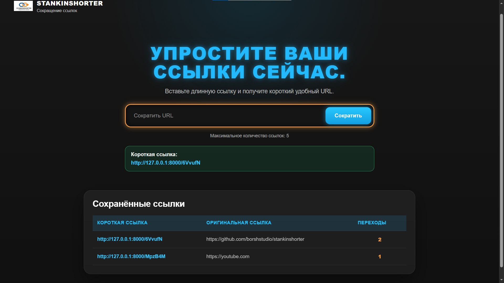

<p align="center">
  
</p>

<h1 align="center">Stankinshorter</h1>

<p align="center">
  Простой сервис для сокращения ссылок на Python, FastAPI, SQLite и Docker.
</p>

<p align="center">
  
  
  
  
</p>

<p align="center">
  
</p>

---

## Описание проекта

**Stankinshorter** — это простое веб-приложение для сокращения длинных ссылок.

Пользователь вводит обычный URL, после чего приложение создаёт короткую ссылку.  
При переходе по короткой ссылке пользователь перенаправляется на оригинальный адрес, а приложение увеличивает счётчик переходов.

Проект реализован на **FastAPI** с простым frontend-интерфейсом на **HTML и CSS**.  
Для хранения данных используется **SQLite**.  
Приложение можно запускать через **Docker** и **Docker Compose**.

---

## Основные возможности

- сокращение длинных URL;
- переход по короткой ссылке на оригинальный URL;
- подсчёт количества переходов;
- хранение ссылок в базе данных SQLite;
- ограничение количества хранимых ссылок через конфигурацию;
- автоматическое удаление наименее используемой ссылки при превышении лимита;
- простой веб-интерфейс;
- запуск через Docker и Docker Compose;
- объектно-ориентированная структура кода;
- наличие тестов.

---

## Функциональные требования

Приложение выполняет следующие функции:

1. По оригинальному URL возвращает короткий URL.
2. По короткому URL возвращает оригинальный URL через перенаправление.
3. Считает количество переходов по каждой короткой ссылке.
4. Количество хранимых ссылок задаётся через конфигурацию.
5. При превышении лимита удаляется:
   - ссылка с наименьшим количеством переходов;
   - если количество переходов одинаковое — самая старая ссылка.

---

## Нефункциональные требования

В проекте выполнены следующие нефункциональные требования:

- используется объектно-ориентированный подход;
- данные хранятся в SQLite;
- поиск ссылок не выполняется линейным перебором;
- для ускорения поиска используются индексы в базе данных;
- проект запускается в Docker;
- проект запускается через Docker Compose;
- присутствуют тесты;
- структура проекта разделена по файлам и зонам ответственности.

---

## Используемые технологии

| Технология | Назначение |
|---|---|
| Python | основной язык программирования |
| FastAPI | backend-фреймворк |
| SQLite | база данных |
| HTML | разметка frontend-части |
| CSS | стилизация интерфейса |
| Jinja2 | шаблонизатор HTML |
| Docker | контейнеризация приложения |
| Docker Compose | удобный запуск проекта |
| Pytest | тестирование |

---

## Структура проекта

```text
Stankinshorter/
│
├── app/
│   ├── main.py
│   ├── config.py
│   ├── database.py
│   ├── models.py
│   ├── storage.py
│   │
│   ├── templates/
│   │   └── index.html
│   │
│   └── static/
│       └── style.css
│
├── assets/
│   └── logo.png
│
├── tests/
│   └── test_app.py
│
├── data/
│   └── urls.db
│
├── Dockerfile
├── docker-compose.yml
├── requirements.txt
├── README.md
└── .gitignore
```

---
# Запуск приложения

## 1. Клонировать репозиторий

git clone https://github.com/username/Stankinshorter.git

cd Stankinshorter

Вместо username нужно указать имя владельца репозитория.

---

## 2. Запустить приложение через Docker Compose

docker compose up --build

Если проект находится в папке с русским названием или Docker выдаёт ошибку с именем проекта, используй команду:

docker compose -p stankinshorter up --build

---

## 3. Открыть приложение

После запуска открой в браузере:

http://127.0.0.1:8000

---

## 4. Остановить приложение

В терминале нажать:

Ctrl + C

Затем выполнить:

docker compose down

Если запуск был через -p stankinshorter, остановить так:

docker compose -p stankinshorter down

---

## 5. Повторный запуск

docker compose up

Если были изменения в коде:

docker compose up --build

---

## 6. Просмотр логов

docker compose logs -f

Если запуск был через -p stankinshorter:

